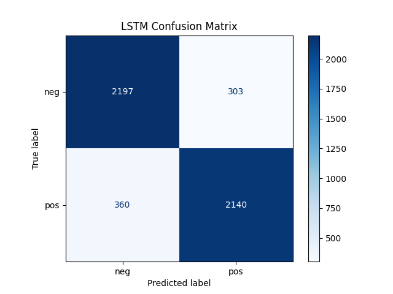
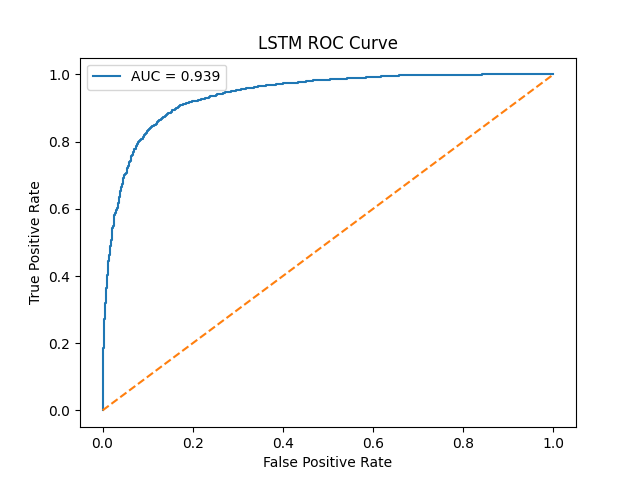
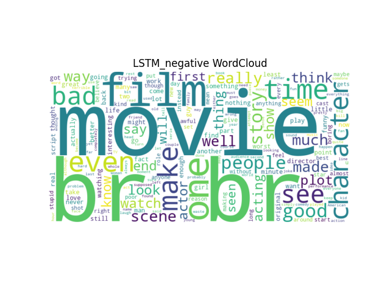
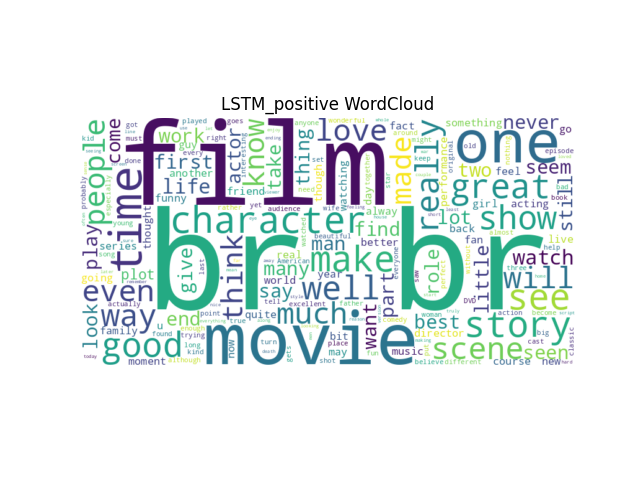

# IMDB Sentiment Analysis (RNN vs LSTM)

> NLP sentiment classification system comparing RNN and LSTM on IMDB reviews.

---

## 🚀 Overview

This project builds an end-to-end sentiment analysis system:

- Positive / Negative classification
- RNN vs LSTM comparison
- Streamlit interactive demo

Goal: demonstrate a **modular NLP pipeline + model comparison framework**.

---

## 📊 Dataset

- IMDB Large Movie Review Dataset
- 50,000 labeled reviews
- Binary classification task

Split:
- Train: 80%
- Validation: 10%
- Test: 10%

---

## 🧠 Models

### 🔹 RNN
- Embedding layer (128-dim)
- SimpleRNN (64 units)
- Dense + Dropout

### 🔹 LSTM
- Embedding layer (128-dim)
- LSTM (128 units)
- Dropout + recurrent dropout
- Dense output layer

---

## ⚙️ Training Config

- Loss: Binary Crossentropy
- Optimizer: Adam
- Batch size: 128
- Epochs: 6

---

## 🏗 System Design

```
Streamlit UI
   ↓
Text Preprocessing
   ↓
Model Selector (RNN / LSTM)
   ↓
Embedding Layer
   ↓
Neural Network Inference
   ↓
Prediction Output
```

Key idea: modular NLP system with interchangeable models.

---

## 📊 Results

| Model | Accuracy | AUC |
|------|---------|-----|
| RNN  | ~0.81   | ~0.88 |
| LSTM | ~0.87   | ~0.93 |

Insight: LSTM better captures long-term dependencies.

---

## 🎯 Demo (Visualizations)

### Confusion Matrix


### ROC Curve


### Negative WordCloud


### Positive WordCloud


---

## 📁 Project Structure

```
imdb-nlp-project/
│
├── app.py
├── requirements.txt
│
├── data/
├── models/
│
├── assets/
│   ├── LSTM_confusion_matrix.png
│   ├── LSTM_negative_wordcloud.png
│   ├── LSTM_positive_wordcloud.png
│   └── LSTM_roc.png
│
└── src/
    ├── train.py
    ├── evaluate.py
    ├── preprocess.py
    └── model.py
```

---

## ▶️ Usage

```bash
python src/train.py
python src/evaluate.py
streamlit run app.py
```

---

## 🧩 Key Concepts

- Text preprocessing (tokenization, padding)
- Word embeddings
- RNN vs LSTM comparison
- Sequence modeling
- Evaluation metrics (AUC, ROC)
- Interpretability via WordCloud

---

## 🔮 Future Work

- Transformer model (BERT)
- Better preprocessing (stopwords, lemmatization)
- Hyperparameter tuning (Optuna)
- FastAPI deployment
- Real-time sentiment dashboard

---

## 👤 Author

Hubert Kuo  
Focus: AI Systems / Machine Learning / NLP